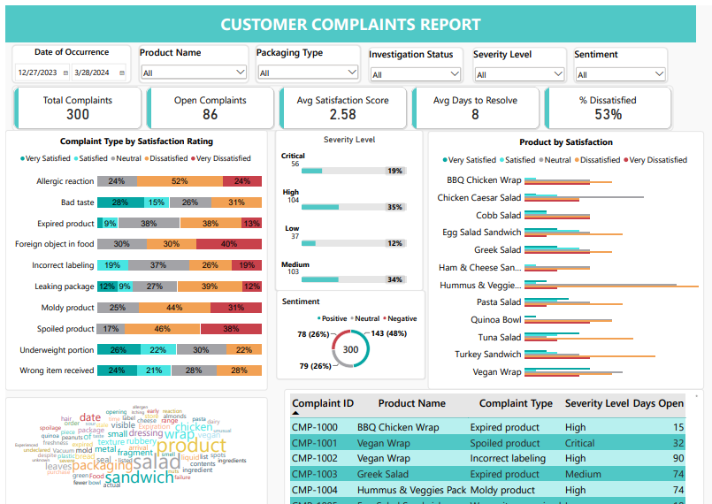
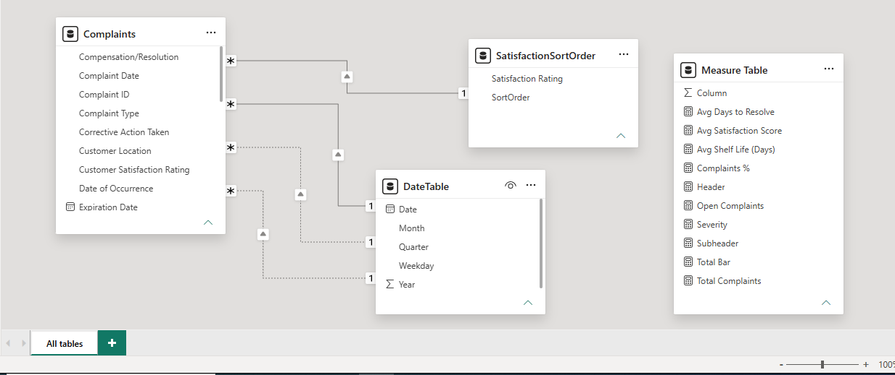

# 📊 Customer Complaints Data Analysis Dashboard

## 🚀 Overview
This project turns raw customer complaint logs from Excel/CSV into a single-page, interactive Power BI business intelligence dashboard for a fresh-food business (salads, wraps, sandwiches and ready-to-eat packs). It is built to answer one question: **where is food quality failing, how badly does it hurt customer satisfaction, and what should be fixed first?**

---

## 📋 Project Background
For a fresh-food producer, quick resolution times and quality control are critical. This dashboard was developed to solve a core business problem: **How do we efficiently track, triage, and solve growing customer issues?**

By building a centralized semantic model and interactive dashboard, this project answers five critical business questions:
1. **Which specific products** trigger the highest volume of consumer complaints?
2. **What are the most common complaint types** and how do they correlate with customer dissatisfaction?
3. **How severe** are incoming tickets, and what percentage remain unaddressed (`Open` status)?
4. **Are we meeting SLA targets** for resolving issues across different product categories?
5. **What underlying keywords and sentiment shifts** are driven by consumer remarks?

---


## 🧩 Dashboard Components

| Visual | Purpose |
| :--- | :--- |
| **Slicers** | Filters the whole page by date, product, investigation status, packaging type, severity and sentiment |
| **KPI Cards** | Monitors complaint volume, open cases, average satisfaction, resolution time and % Dissatisfied |
| **Product by Satisfaction** | Shows complaint volume per product and how customers rated the outcome (colour), sorted by complaint volume from highest to lowest |
| **Complaint Type by Satisfaction** | Compares the satisfaction mix across complaint types (100% stacked) to find the types that hurt customers most, such as spoilage, foreign objects, mould and allergens |
| **Severity Analysis** | Displays the distribution of complaint severity (Critical, High, Medium, Low) |
| **Sentiment Donut Chart** | Shows the share of positive, neutral and negative sentiment in complaint descriptions, using the same colours as the satisfaction scale |
| **Word Cloud** | Highlights recurring complaint keywords and phrases, such as seal failure and early spoilage |
| **Complaint Detail Table** | Lists open and in-progress complaints for review |


---
## 🛠️ Tools & Tech Stack

* **Excel:** The source data container storing raw complaint entries, dates, remarks, and satisfaction ratings.
* **Power Query:** Utilized to clean text columns, manage data types, and filter out null values.
* **Power BI Desktop & DAX:** Used to engineer an optimized star-schema data model and construct custom business logic metrics.
* **AI Cognitive Services (Sentiment Analysis):** Leveraged Power BI's native AI insights to perform sentiment analysis and key-phrase extraction on `Issue Description`
* **Word Cloud Custom Visual:** Integrated to visually highlight recurring complaint phrases on the canvas.

---

## 🗂️ Data Architecture & Modeling
To maximize performance and query efficiency, I transformed the flat Excel table into an optimized **Star Schema** data model. 

### Data Model Layout


### Schema Relationships
* `Complaints` (Fact Table) ─── `1:*` ─── `DateTable` (Dimension Table)
* `Complaints` (Fact Table) ─── `1:*` ─── `SatisfactionSortOrder` (Dimension Table)

### Custom Structural Tables
To achieve accurate calendar drill-downs and custom sorting behaviors, the following DAX calculated tables were implemented:

* **Date Table (`DateTable`):** Automatically bounds itself to the minimum complaint date and maximum resolution date to ensure continuous timeline reporting.
  ```dax
  DateTable = 
  ADDCOLUMNS(
      CALENDAR(
          MIN('Complaints'[Complaint Date]),
          MAX('Complaints'[Resolution Date])
      ),
      "Year", YEAR([Date]),
      "Month", FORMAT([Date], "MMMM"),
      "Quarter", "Q" & QUARTER([Date]),
      "Weekday", FORMAT([Date], "dddd")
  )
  ```

* **Satisfaction Sort Order (`SatisfactionSortOrder`):** Fixes the default alphabetical sorting flaw in native charts by mapping strings to explicit indexes.
  ```dax
  SatisfactionSortOrder = 
  DATATABLE(
      "Satisfaction Rating", STRING,
      "SortOrder", INTEGER,
      {
          {"Very Satisfied", 1},
          {"Satisfied", 2},
          {"Neutral", 3},
          {"Dissatisfied", 4},
          {"Very Dissatisfied", 5}
      }
  )
  ```

---

## 📐 DAX Measures Reference
All business logic functions are neatly contained within a dedicated **`Measure Table`** for clean organization.

| Measure Name | DAX Code / Expression | Description |
| :--- | :--- | :--- |
| **Total Complaints** | `COUNTROWS('Complaints')` | Calculates absolute volume of consumer issues logged. |
| **Open Complaints** | `CALCULATE(COUNTROWS('Complaints'), 'Complaints'[Investigation Status] = "Open")` | Tracks active, unresolved tickets requiring immediate attention. |
| **Complaints %** | `VAR _Complaints = CALCULATE([Total Complaints], ALL(Complaints)) RETURN DIVIDE([Total Complaints], _Complaints)` | Computes percentage distribution across dynamically filtered categories. |
| **Avg Satisfaction Score** | `AVERAGE('Complaints'[SatisfactionScore])` | Evaluates overall post-resolution customer experience (Scale 1-5). |
| **% Dissatisfied** | `DIVIDE(CALCULATE(COUNTROWS(Complaints), Complaints[Satisfaction Rating] IN {"Dissatisfied","Very Dissatisfied"}), COUNTROWS(Complaints))` | Share of customers rating Dissatisfied or Very Dissatisfied. |
| **Days Open** | `DATEDIFF(MIN(Complaints[Complaint Date]), CALCULATE(MAX(Complaints[Complaint Date]), ALL(Complaints)), DAY)` | Age of a complaint, measured against the latest complaint date in the data. |
| **Avg Days to Resolve** | `AVERAGEX(FILTER('Complaints', NOT ISBLANK('Complaints'[Resolution Date])), DATEDIFF('Complaints'[Complaint Date], 'Complaints'[Resolution Date], DAY))` | Tracks operational speed by calculating turnaround time for closed tickets. |
| **Avg Shelf Life (Days)** | `AVERAGEX(SUMMARIZE('Complaints', 'Complaints'[Product Name], "ShelfLife", AVERAGEX(FILTER('Complaints', 'Complaints'[Manufacturing Date] <> BLANK() && 'Complaints'[Expiration Date] <> BLANK()), DATEDIFF('Complaints'[Manufacturing Date], 'Complaints'[Expiration Date], DAY))), [ShelfLife])` | Advanced metric analyzing the lifecycle gap between manufacturing and expiration dates per item. |
| **Severity** | `SELECTEDVALUE(Complaints[Severity Level])` | Dynamically captures and returns the current user-selected context for filter flags. |

---
## 🧠 Text Analytics

A key part of this project was combining **structured complaint information with unstructured customer feedback**.

Power BI's sentiment analysis capabilities were used to analyse complaint descriptions and identify sentiment patterns.

Key phrases were also extracted from complaint text and incorporated into a **word cloud** to surface recurring themes.

The analytical workflow was:

```text
Complaint Description
        ↓
Sentiment Analysis
        ↓
Key Phrase Extraction
        ↓
Sentiment Visual + Word Cloud
        ↓
Customer Experience Insights
```

This provides an additional layer of analysis beyond simply counting complaints.

---

### 📊 Executive Summary KPI Overview
* **Total Intake Volume:** **300** customer complaints logged across the operational window.
* **Active Operational Backlog:** **86** complaints (**29%**) currently hold an `Open` status. **49** of these are **Critical or High** severity, including **18 Critical**, so they need immediate attention.
* **Turnaround Efficiency:** The organization maintains a baseline average of **8 days** to resolve a ticket.
* **Customer Satisfaction:** The average rating is **2.58 / 5**, and **53%** of customers (**158**) are Dissatisfied or Very Dissatisfied.
* **Quality Baseline:** The average shelf life of cataloged products sits at **38 days**.

---

### 🔍 Core Analytical Deep Dives

| Focus Area | Key Metrics & Data Assertions | Systemic Drivers |
| :--- | :--- | :--- |
| **Product&nbsp;Risks** | **Hummus Pack** (**36** logs), **Vegan Wrap** (**29**), **Greek Salad** (**28**, tied with Turkey Sandwich). | Complaints are spread across 12 products. The top 3 account for 93 of 300 (**31%**), so this is a portfolio-wide quality issue, not a few problem SKUs. |
| **Severity&nbsp;Split** | **High** **35%** (**104**); **Critical** **19%** (**56**). | Critical and High are **53%** of all complaints, and **57%** of the open backlog (49 of 86). |
| **Text&nbsp;Mining** | **Negative sentiment** leads at **48%** (**143** records). | Seal and freshness themes recur (`"vacuum seal"`, `"seal failure"`, `"early spoilage"`). |
| **Risk&nbsp;Anchors** | **Spoiled** (1.79), **Foreign Object** (1.90), **Moldy** (1.94) and **Allergic Reaction** (2.00) generate the lowest ratings. |  Food-safety and regulatory exposure. Foreign objects trace mainly to **QC inspection** (18 of 40) and **equipment failure** (12). Allergens trace to **cross-contamination** (8 of 21) and **supplier miscommunication** (8). |

---
### Satisfaction depends on what went wrong, not which product

| Complaint type | Avg rating (1–5) | % Dissatisfied |
| :--- | :---: | :---: |
| Spoiled product | **1.79** | 83% |
| Foreign object in food | 1.90 | 70% |
| Moldy product | 1.94 | 75% |
| Allergic reaction | 2.00 | 76% |
| … | | |
| Bad taste | 3.41 | 31% |
| Wrong item received | 3.41 | 28% |
| Underweight portion | 3.52 | 22% |

Severity tells the same story. Critical and High complaints average **1.89** and **1.96**, and Medium and Low average 3.24 and 3.54. Product averages only range from 2.1 to 2.9, with **BBQ Chicken Wrap** (2.10) and **Quinoa Bowl** (2.22) lowest.

---

## 💡 Key Conclusions & Action Items
* **Triage the Backlog:** Route the **49 open Critical/High cases** to the front of the queue, starting with the **Vegan Wrap** (10) and **Hummus Pack** (6), which lead that list. The remaining open cases can follow standard SLAs.
* **Tighten In-Plant Quality Control:** Foreign objects are the highest-volume complaint type (**40**), and **19** of them are metal fragments in sandwiches. QC inspection is the most common root cause, followed by equipment failure. Prioritise metal detection, equipment maintenance and hygiene checks on production lines.
* **Fix Seals, Cold Chain and Shelf Life Together:** Seal failures appear in **19** complaints across **10 different products**, so this is a plant-wide packaging issue, not just the wrap and sandwich lines. Spoilage has three similar drivers: shelf life set too long (9 of 24), transit temperature deviation (8) and improper sealing (7). Review shelf-life limits and cold-chain handling alongside seal integrity.
* **Strengthen Allergen & Labelling Controls:** Allergic reactions have the lowest-scoring satisfaction profile among safety issues (2.00). Complaints involve undeclared nuts and dairy in products labelled vegan. Audit allergen cross-contamination, labelling accuracy and ingredient-supplier communication.
* **Initiate Targeted Supplier Audits:** Mould complaints cite contaminated raw ingredients (**12 of 32**), and slimy or moldy salad leaves appear in **23** complaint descriptions. Prioritise on-site checks for leafy-green suppliers.
